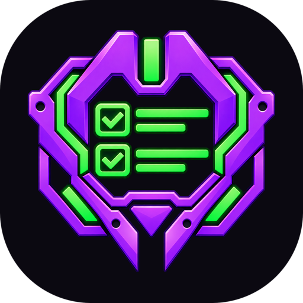
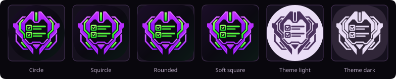
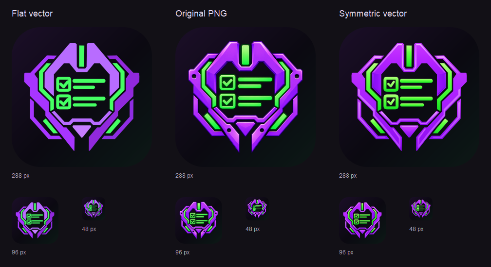

# MECHA//TODO app icons

This directory contains the Google Play listing icon, plus vector source layers and Android resource templates for the existing Kotlin/Compose app module. Product integration is pending. Jetpack Compose does not change launcher-icon packaging. Android reads these files from the app module's `res` directory.

## Google Play listing icon

Upload [`google-play-icon.png`](./google-play-icon.png) to the Google Play store listing. It uses [`../appicon_logo.png`](../appicon_logo.png), preserving the supplied logo's purple armor, green checklist, bevels, and lighting.

The export is 512 × 512 px, 32-bit PNG with 8-bit RGBA channels and explicit sRGB metadata. The background is opaque `#0B0911`. The 1254 × 1254 source canvas is resized to 432 × 432 and centered with 40 px of additional space on each side. Its existing transparent margins remain part of the artwork placement.

The upload has square corners and no outer tile shadow. Google applies the corner mask and outer shadow; lighting and shadows within the logo are permitted by the [Google Play icon specifications](https://developer.android.com/distribute/google-play/resources/icon-design-specifications).

Rebuild the asset and previews from the repository root with PowerShell and ImageMagick 7 installed:

```powershell
pwsh -NoProfile -File docs/assets/appicon/generate-google-play-icon.ps1
```

The script checks dimensions, 8-bit RGBA encoding, sRGB color space and metadata, full opacity, and the 1024 KB size limit. It exports rounded previews at [512 px](./google-play-previews/rounded-512.png), [96 px](./google-play-previews/rounded-96.png), and [48 px](./google-play-previews/rounded-48.png). These simulate the documented 30% corner radius and omit Google's dynamic shadow. Upload the square file, not a preview.



The Android launcher foreground uses vector geometry with colors and surface shading inspired by the same PNG. It is separate from this store listing export.

## Files

| File | Purpose |
| --- | --- |
| `appicon-background.svg` | Opaque color background layer. |
| `appicon-foreground.svg` | Transparent color foreground layer. |
| `appicon-monochrome.svg` | Single-color alpha layer for themed icons. |
| `appicon-preview.svg` | Self-contained preview of launcher masks and themed treatments. |
| `appicon-foreground-comparison.svg` | Flat vector, embedded original PNG, and symmetric vector revision at 288, 96, and 48 px. |
| `appicon-foreground-comparison.png` | Rendered copy of the comparison for image viewers. |
| `android/drawable/ic_launcher_*.xml` | Android-ready vector drawables matching the SVG layers. |
| `android/mipmap-anydpi-v26/ic_launcher.xml` | Adaptive icon definition for Android 8 through 12L. |
| `android/mipmap-anydpi-v33/ic_launcher.xml` | Android 13+ definition with the monochrome layer. |
| `verify-assets.ps1` | Checks dimensions, transforms, paths, foreground paints and gradients, and resource references. |

The three layer SVGs are the editable design sources. The Android XML files mirror their geometry and colors. `appicon-preview.svg` embeds copies of the layer paths and gradients so repository viewers can render it without loading external files. The verification script compares foreground path paints, gradient coordinates, stops, and checklist stroke styles across SVG, Android, and the launcher preview.



## Launcher design contract

- Every layer is `108 × 108 dp`. The SVG files use a `512 × 512` view box for direct reuse of the original helmet paths.
- The helmet uses a centered `0.6` scale. Its filled geometry is about `59 × 56 dp`, and the complete mark fits inside the guaranteed `66 dp` safe circle.
- The outer `18 dp` on each side belongs to the launcher mask and motion effects. No important foreground detail enters that area.
- The background is opaque and full bleed. It does not contain a rounded-square or circle mask.
- The foreground has transparent negative space. Surface gradients and inset bevel faces provide depth without outline strokes, glow, blur, or cast shadows.
- The monochrome layer is white on transparency. Android uses its alpha and applies the user's theme colors.

The foreground keeps the geometry from `../mecha_todo_helmet.svg`, including its simplified armor and readable checklist strokes. `../appicon_logo.png` supplies the visual reference for the saturated violet armor, lime-green highlights, and inset bevel faces. Ten facet pairs are exact reflections about the helmet's original x=255.8 axis. Paired gradients use identical color stops and mirrored coordinates. The center chin faces are symmetric, and paired base surfaces share vertical gradients. This gives both sides the same lighting treatment. The source silhouette retains its small tracing irregularities.

Gradients use explicit viewport coordinates so the SVG and Android drawable share the same treatment. The checklist bars shade vertically across their thickness; their original widths and round caps remain intact. The checkmarks use a 9-unit stroke instead of 12, with inset paths that leave 3 viewport units of horizontal clearance on each side. Their lighter lime-green gradient helps them remain visible at 96 px. The boxes keep their original 12-unit strokes. The verification script checks mirrored facet coordinates and paired gradient colors and directions.

The background and monochrome assets are unchanged. The foreground helmet, checkbox frames, and bars retain their original paths, with the surface facets drawn over the armor. Only the foreground checkmarks have shorter paths and thinner strokes.

## Foreground comparison



Open the [self-contained SVG comparison](./appicon-foreground-comparison.svg) to inspect the artwork. The center column embeds the original `appicon_logo.png` bytes. All columns use the same launcher background and rounded mask. The PNG retains its proportions and is centered on a 288 × 288 viewport area to approximately match the vectors' visible width. The rows show 288, 96, and 48 px icons. The PNG column is a visual reference only, not an Android resource.

## Palette

| Role | Value |
| --- | --- |
| Main armor gradient | `#C638FF` to `#AC21FF` to `#8D0CEF` |
| Crown front faces | `#C934FF` to `#B322FF` to `#A017FC` |
| Crown inset bevels | `#F0B2FF` to `#DD80FF` to `#C856FF` |
| Cheek faces | `#880CF1` to `#9411FC` to `#A11CFF` |
| Checklist and accent gradients | `#B5FF7E` to `#64FF42` to `#31F32B` to `#17DC24` |
| Checkmark gradients | `#C1FF8C` to `#96FF65` to `#62F548` |
| Background gradient | `#231133` to `#0B0911` to `#0C2118` |
| Background accents | `#B86CFF`, `#45FF63` |

## Android integration

1. Copy the contents of `android/` into `app/src/main/res/`, preserving the folder names.
2. Point both `android:icon` and `android:roundIcon` on the `<application>` element to the approved adaptive icon family. Replace competing template references and unqualified resources. Use `MECHA//TODO` as the launcher label.
3. Open `ic_launcher.xml` in Android Studio and inspect every mask preview and the themed-icon modes.
4. The approved minimum is API 26, so supported devices do not need legacy-density fallbacks. For the Google Play listing, use `google-play-icon.png` as described above.

The API 26 file omits `<monochrome>`. The API 33 override adds it where themed icons are supported, while older Android versions receive only elements they understand.

Foreground gradients use native `VectorDrawable` gradient fills and strokes, supported since API 24 and compatible with these API 26+ adaptive-icon templates. Preserve the full approved family, including background gradients and corner accents. Validate resource linking and real launcher masks in the existing app module during integration. The app's light/dark palette does not recolor the approved full-color launcher art; Android controls themed-icon tint.

Run the local consistency check from this directory:

```powershell
pwsh -File ./verify-assets.ps1
```

## References

- [Android adaptive icon design and implementation](https://developer.android.com/develop/ui/compose/system/icon_design_adaptive)
- [Android Studio app icon generation](https://developer.android.com/studio/write/create-app-icons)
- [Android vector drawables](https://developer.android.com/develop/ui/views/graphics/vector-drawable-resources)
- [Google Design: Designing Adaptive Icons](https://medium.com/google-design/designing-adaptive-icons-515af294c783)

The current Android guidance specifies vector-preferred foreground and background layers, an optional monochrome layer for user theming, a `108 × 108 dp` canvas, a `66 dp` safe zone, and a `48` to `66 dp` logo size.
