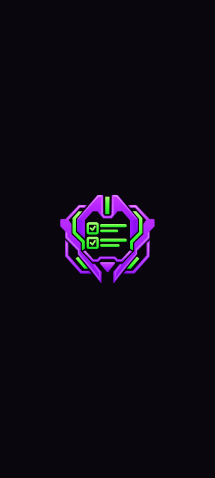

# MECHA//TODO Android splash screen

Prepared resources for the existing Kotlin/Compose app module. Product splash integration is pending.

The splash uses the current launcher helmet with its saturated violet armor, mirrored bevels, gradients, and lime-green checklist. The prepared previews use solid dark `#09070D`. The approved native design also requires solid light `#F5F1F8`, selected automatically from system appearance. There is no text, separate icon tile, spinner, or custom animation.



The preview represents a 360 by 800 dp window at mdpi. It omits system bars and device-specific positioning. Also inspect the [landscape preview](./splash-preview-landscape.png) and [safe-circle preview](./splash-safe-area.png). The dashed circle is a review guide only; it is absent from the Android drawable.

## Assets and sizing

| File | Purpose |
| --- | --- |
| `android/drawable/ic_splash.xml` | Static Android vector, generated from the current launcher foreground. |
| `android/values/splash_colors.xml` | Prepared dark splash background color; add the approved light/night variants during app integration. |
| `android/values/splash_themes.xml` | Starting theme for AndroidX SplashScreen. |
| `splash-icon.svg` | Transparent vector counterpart for inspection. |
| `splash-preview*.svg` and `.png` | Self-contained portrait and landscape placement previews. |
| `splash-safe-area.svg` and `.png` | Artwork with the 192 dp safe circle overlaid. |
| `generate-splash-assets.ps1` | Rebuilds the drawable and previews from launcher sources. |

The icon canvas is 288 by 288 dp, with all visible artwork inside a centered circle 192 dp in diameter. This follows Android's [splash dimensions for an icon without a background](https://developer.android.com/develop/ui/views/launch/splash-screen#dimensions).

The generator preserves the launcher's 512 by 512 viewport, centered 0.6 scale, paths, fills, gradients, and strokes. Its 66 dp launcher safe circle scales to 176 dp here, leaving space inside the splash's 192 dp circle. The visible helmet is approximately 158 by 148 dp. The larger canvas is transparent padding, not the helmet's visible size.

The full-screen background is solid. The gradients inside the helmet remain part of the vector artwork. Android's [splash guidance](https://developer.android.com/develop/ui/views/launch/splash-screen#elements) distinguishes the icon from the single-color window background.

## Regenerate

From the repository root with PowerShell 7 and ImageMagick 7 installed:

```powershell
pwsh -NoProfile -File docs/assets/splash/generate-splash-assets.ps1
```

Edit the foreground in `../appicon/`, keeping its SVG and Android XML consistent, then regenerate. The script first runs the existing launcher consistency checks. Do not edit the generated splash artwork independently. Edit the background in `android/values/splash_colors.xml` and regenerate previews if the app background changes.

## Integrate into the Android port

1. Copy the contents of `android/` into the app module's `src/main/res/`, preserving folder names.
2. Add a compatible stable AndroidX core-splashscreen dependency through the version catalog during the build-foundation phase. Check the [AndroidX release notes](https://developer.android.com/jetpack/androidx/releases/core) and verify the selected version with the agreed SDK and build stack.
3. Connect `postSplashScreenTheme` to the app's existing regular `Theme.MechaTodo` window theme and verify its day/night variants during integration.
4. Give the launcher activity `android:theme="@style/Theme.MechaTodo.Starting"` in `AndroidManifest.xml`. Keep the application's regular theme and launcher icon configuration.
5. Install the splash before `super.onCreate()` in the existing Compose activity:

```kotlin
import androidx.core.splashscreen.SplashScreen.Companion.installSplashScreen

override fun onCreate(savedInstanceState: Bundle?) {
    installSplashScreen()
    super.onCreate(savedInstanceState)
    setContent {
        // The port's existing app theme and root composable.
    }
}
```

This uses Android's [recommended theme and activity integration](https://developer.android.com/develop/ui/views/launch/splash-screen/migrate). `windowSplashScreenAnimatedIcon` also accepts a static drawable. No animation duration is needed for this asset.

Set the regular window's `android:windowBackground` and the first Compose background to the matching splash color. Provide light `#F5F1F8` and night `#09070D` resources, with matching system-bar icon appearance. Keep the colored helmet unchanged. Verify transitions in both modes without a background flash.

Let Android dismiss the splash at the first useful app frame. If storage validation is slow, show an ordinary Opening screen before the task list or local-data error screen. Any `setKeepOnScreenCondition` reads only a quick in-memory flag; keep disk work outside the callback. Do not add a timer, wait for network work, or leave an error hidden behind the splash. See the [AndroidX SplashScreen API](https://developer.android.com/reference/kotlin/androidx/core/splashscreen/SplashScreen).

The current foreground uses native vector gradients. The approved app minimum and launcher templates both target API 26 and later.

## Verify in the port

- Build with Android resource linking to validate the actual theme and library references.
- Inspect cold and warm launches on the minimum supported API, Android 12, and the newest supported version. Returning to an already running activity should not introduce another splash screen.
- Check portrait, landscape, system light and dark settings, gesture navigation, and three-button navigation. Look for clipped artwork, a second splash, or a background flash.
- Check fast startup, slow local initialization, and initialization failure. The app must reach either usable content or its error screen without an artificial delay.

The checked-in previews verify intended dark artwork and placement only. Resource linking, light-mode integration and device validation remain required in the existing app module. Follow the [native specification](../../IDEA.md) and [implementation plan](../../IMPLEMENTATION_PLAN.md).
